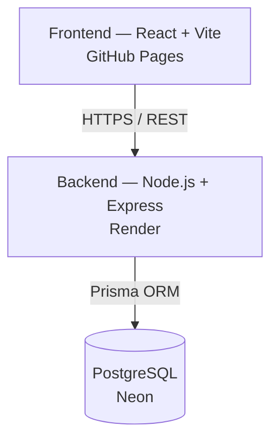

# Controle de Estoque — Sistema ERP

Sistema ERP completo de controle de estoque para comércio, composto por API REST, aplicação web e app mobile.

[](https://react.dev)
[](https://www.typescriptlang.org)
[](https://nodejs.org)
[](https://expressjs.com)
[](https://www.prisma.io)
[](https://www.postgresql.org)
[](https://jwt.io)
[](https://www.docker.com)
[](https://github.com/features/actions)

## 🚀 Demonstração Online

[](https://renanluigy-png.github.io/inventory-management-saas/)
[](https://inventory-management-saas-1.onrender.com/docs)
[](https://github.com/renanluigy-png/inventory-management-saas)

Health check da API: [inventory-management-saas-1.onrender.com/health](https://inventory-management-saas-1.onrender.com/health)

> ⚠️ O backend roda no plano gratuito do Render, que hiberna após períodos de inatividade — a primeira requisição pode levar até ~1 minuto para responder enquanto o serviço "acorda".

### Conta de Demonstração

| Campo  | Valor             |
|--------|-------------------|
| E-mail | `admin@demo.com`  |
| Senha  | `123456`          |

Essas credenciais dão acesso de administrador a uma empresa de demonstração já populada, permitindo testar as principais funcionalidades do sistema — produtos, estoque, vendas, dashboard, relatórios e mais — sem precisar criar uma conta.

---

## Arquitetura



---

## Executando Localmente

1. Clone o repositório:
   ```bash
   git clone https://github.com/renanluigy-png/inventory-management-saas.git
   cd inventory-management-saas
   ```
2. Instale as dependências do backend e do frontend.
3. Configure o arquivo `.env` de cada pacote a partir do respectivo `.env.example`.
4. Execute o backend (`npm run dev` dentro de `backend/`).
5. Com o backend em execução, a documentação Swagger fica disponível em:

   ```
   http://localhost:3333/docs
   ```

   > Esse endereço funciona **apenas localmente** — só é acessível na sua própria máquina enquanto o backend estiver rodando.

O passo a passo completo, com backend, frontend e mobile, está em [Desenvolvimento Local](#desenvolvimento-local).

---

## Sumário

- [🚀 Demonstração Online](#-demonstração-online)
- [Arquitetura](#arquitetura)
- [Executando Localmente](#executando-localmente)
- [Funcionalidades](#funcionalidades)
- [Stack Tecnológico](#stack-tecnológico)
- [Pré-requisitos](#pré-requisitos)
- [Início Rápido (Docker)](#início-rápido-docker)
- [Desenvolvimento Local](#desenvolvimento-local)
- [Variáveis de Ambiente](#variáveis-de-ambiente)
- [Testes](#testes)
- [Build de Produção](#build-de-produção)
- [Mobile (EAS Build)](#mobile-eas-build)
- [Estrutura do Projeto](#estrutura-do-projeto)
- [Scripts Disponíveis](#scripts-disponíveis)
- [API Documentation](#api-documentation)

---

## Funcionalidades

- **Autenticação** — JWT com roles (Admin, Gerente, Funcionário, Caixa), sessão segura via sessionStorage
- **Multi-tenant SaaS** — Isolamento total por empresa via `companyId` no JWT; painel Master para gerenciar todas as empresas
- **Produtos** — CRUD completo, imagem, código de barras, SKU automático
- **Estoque** — Movimentações (entrada/saída/ajuste/perda/devolução), histórico completo, alertas de mínimo
- **Vendas (PDV)** — Carrinho, múltiplas formas de pagamento, desconto
- **Caixa** — Abertura/fechamento, sangria, suprimento
- **Clientes** — Cadastro com CPF, histórico de compras
- **Categorias** — Organização de produtos com soft delete
- **Promoções** — Regras de desconto automático
- **Relatórios** — Financeiro e inventário com export PDF/Excel
- **Dashboard** — Métricas em tempo real, gráficos de faturamento e lucro
- **Auditoria** — Log automático de todas as operações de escrita
- **Usuários** — Gestão de acesso por perfil (MASTER, ADMIN, GERENTE, FUNCIONARIO, CAIXA)
- **IA integrada** — Chat com contexto do negócio via Anthropic Claude, OpenAI ou provider local
- **Pagamentos PIX** — Mercado Pago, PagSeguro, Asaas, Gerencianet, Stripe (provider plugável)
- **WhatsApp** — Notificações via Meta Cloud, Evolution API ou Z-API (provider plugável)
- **Mobile** — App nativo Android/iOS com leitor de código de barras e modo offline

---

## Stack Tecnológico

| Camada    | Tecnologia                                                  |
|-----------|-------------------------------------------------------------|
| Backend   | Node.js 22, Express 5, TypeScript, Prisma ORM, PostgreSQL   |
| Frontend  | React 19, Vite 6, TailwindCSS 3, TanStack Query 5, Zustand  |
| Mobile    | React Native, Expo SDK 52, Expo Router 4                    |
| Infra     | Docker, Docker Compose, Nginx, GitHub Actions               |
| Testes    | Jest + Supertest (backend), Vitest + Testing Library (web)  |

---

## Pré-requisitos

| Ferramenta     | Versão mínima | Observação                            |
|----------------|---------------|---------------------------------------|
| Node.js        | 22.x          |                                       |
| npm            | 10.x          |                                       |
| PostgreSQL      | 16.x          | Apenas para dev local sem Docker      |
| Docker         | 25.x          | Para execução containerizada          |
| Docker Compose | 2.x           |                                       |
| Expo CLI       | 10.x          | Apenas para mobile                    |

---

## Início Rápido (Docker)

```bash
# 1. Clone o repositório
git clone https://github.com/seu-usuario/controle-estoque.git
cd controle-estoque

# 2. Configure as variáveis de ambiente
cp .env.example .env
# Edite .env e defina JWT_SECRET e as senhas do banco

# 3. Suba todos os serviços
docker compose up -d

# 4. Acesse
# Frontend:  http://localhost
# API:       http://localhost:3333
# Docs:      http://localhost:3333/docs
# Health:    http://localhost:3333/health
```

> Na primeira execução as migrations são aplicadas automaticamente.

**Credenciais padrão (seed):**

| E-mail            | Senha    | Perfil | Empresa           |
|-------------------|----------|--------|--------------------|
| `admin@demo.com`  | `123456` | ADMIN  | Loja Exemplo LTDA |

> Mesma conta usada na [Demonstração Online](#-demonstração-online). Um usuário MASTER também é criado a partir de `MASTER_EMAIL`/`MASTER_SENHA` definidos no `.env` (veja [Variáveis de Ambiente](#variáveis-de-ambiente)).

---

## Desenvolvimento Local

### Backend

```bash
cd backend
cp .env.example .env          # Configure DATABASE_URL e JWT_SECRET
npm install
npx prisma migrate dev        # Cria o banco e aplica migrations
npx prisma db seed            # Popula com dados iniciais
npm run dev                   # http://localhost:3333
```

### Frontend

```bash
cd frontend
cp .env.example .env
npm install
npm run dev                   # http://localhost:5173
```

### Mobile

```bash
cd mobile
cp .env.example .env          # Configure EXPO_PUBLIC_API_URL
npm install --legacy-peer-deps
npm start                     # Inicia Metro Bundler

# Em outro terminal:
npm run android               # Emulador Android (necessita Android Studio)
npm run ios                   # Simulador iOS (somente macOS + Xcode)
```

---

## Variáveis de Ambiente

### Backend (`backend/.env`)

| Variável         | Descrição                              | Padrão                  |
|------------------|----------------------------------------|-------------------------|
| `NODE_ENV`       | Ambiente                               | `development`           |
| `PORT`           | Porta do servidor                      | `3333`                  |
| `DATABASE_URL`   | URL PostgreSQL                         | —                       |
| `JWT_SECRET`     | Chave secreta JWT (min. 32 chars)      | — (obrigatória)         |
| `JWT_EXPIRES_IN` | Duração do token em segundos           | `28800`                 |
| `MASTER_SENHA`   | Senha do administrador master          | — (obrigatória)         |
| `CORS_ORIGIN`    | Origem CORS permitida                  | `http://localhost:5173` |

> Gere o JWT_SECRET com: `openssl rand -base64 64`

> Veja [`backend/.env.example`](backend/.env.example) para a lista completa com todos os providers opcionais (IA, PIX, WhatsApp, storage, fiscal).

### Frontend (`frontend/.env`)

| Variável       | Descrição              | Padrão                                     |
|----------------|------------------------|--------------------------------------------|
| `VITE_API_URL` | URL base da API        | `""` (vazio — usa proxy Vite em dev)       |

### Mobile (`mobile/.env`)

| Variável               | Descrição        | Padrão                  |
|------------------------|------------------|-------------------------|
| `EXPO_PUBLIC_API_URL`  | URL da API       | `http://10.0.2.2:3333`  |

### Docker Compose (`.env` raiz)

| Variável           | Descrição                     |
|--------------------|-------------------------------|
| `POSTGRES_USER`    | Usuário PostgreSQL             |
| `POSTGRES_PASSWORD`| Senha PostgreSQL               |
| `POSTGRES_DB`      | Nome do banco                  |
| `JWT_SECRET`       | Chave secreta JWT              |
| `CORS_ORIGIN`      | URL do frontend em produção    |
| `BACKEND_PORT`     | Porta do backend (padrão: 3333)|
| `FRONTEND_PORT`    | Porta do frontend (padrão: 80) |

---

## Testes

### Backend — Jest + Supertest

```bash
cd backend
npm test                     # Todos os testes (62)
npm run test:unit            # Unit tests — services
npm run test:integration     # Integration tests — rotas HTTP
npm run test:coverage        # Com relatório de cobertura
npm run test:watch           # Watch mode
```

### Frontend — Vitest + Testing Library

```bash
cd frontend
npm test                     # Todos os testes (58)
npm run test:watch           # Watch mode interativo
npm run test:coverage        # Com relatório de cobertura
npm run test:ui              # Interface visual Vitest
```

---

## Build de Produção

### Sem Docker

```bash
# Backend
cd backend && npm run build && npm start

# Frontend
cd frontend && npm run build
# Sirva dist/ com qualquer servidor estático (nginx, caddy...)
```

### Com Docker (recomendado)

```bash
# Build e deploy completo
docker compose up -d --build

# Logs em tempo real
docker compose logs -f

# Atualizar apenas o backend
docker compose up -d --build backend

# Parar tudo
docker compose down
```

---

## Mobile (EAS Build)

```bash
cd mobile
npm install -g eas-cli
eas login

# Build para teste interno (APK)
eas build --profile preview --platform android

# Build para produção (AAB para Google Play)
eas build --profile production --platform android

# Atualização OTA sem nova build
eas update --branch production --message "Correção crítica"
```

> Configure `projectId` em `mobile/app.json` e `mobile/eas.json` com seu ID do projeto EAS.

---

## Estrutura do Projeto

```
controle-estoque/
├── backend/                     # API REST
│   ├── prisma/
│   │   ├── schema.prisma        # Schema do banco
│   │   ├── migrations/          # Migrations Prisma
│   │   └── seed.ts              # Dados iniciais
│   ├── src/
│   │   ├── app.ts               # Express app (sem listen)
│   │   ├── server.ts            # Ponto de entrada
│   │   ├── config/              # env, database, swagger
│   │   ├── controllers/         # Handlers HTTP
│   │   ├── services/            # Lógica de negócio
│   │   ├── repositories/        # Camada de dados (Prisma)
│   │   ├── middlewares/         # auth, audit, error, rate-limit
│   │   ├── routes/              # Definição de rotas
│   │   └── __tests__/           # Testes (unit + integration)
│   ├── Dockerfile
│   └── docker-entrypoint.sh
│
├── frontend/                    # SPA React
│   ├── src/
│   │   ├── api/                 # Clients axios por domínio
│   │   ├── components/
│   │   │   ├── ui/              # Button, Input, Badge, Modal...
│   │   │   └── shared/          # PrivateRoute, ErrorBoundary
│   │   ├── hooks/               # useDebounce, useAuth, usePermissions
│   │   ├── layouts/             # AuthLayout, DashboardLayout
│   │   ├── pages/               # Dashboard, Products, Sales...
│   │   ├── store/               # Zustand (auth, theme)
│   │   └── __tests__/           # Testes Vitest
│   ├── Dockerfile
│   └── nginx.conf
│
├── mobile/                      # App React Native
│   ├── app/                     # Expo Router (file-based)
│   │   ├── (auth)/              # Login
│   │   ├── (app)/               # Tabs (dashboard, produtos, pdv...)
│   │   └── scanner.tsx          # Leitor de código de barras
│   ├── src/
│   │   ├── api/                 # Clients axios
│   │   ├── components/          # Componentes nativos
│   │   ├── store/               # Zustand (auth, cart)
│   │   └── theme/               # Cores e dark mode
│   ├── eas.json                 # Configuração EAS Build
│   └── app.json                 # Configuração Expo
│
├── .github/
│   └── workflows/
│       └── ci.yml               # CI/CD GitHub Actions
├── docker-compose.yml           # Orquestração
├── .env.example                 # Template variáveis Docker
└── README.md
```

---

## Scripts Disponíveis

### Raiz

```bash
npm run dev       # Backend + Frontend simultâneos
npm run build     # Build de produção completo
npm test          # Todos os testes
```

### Backend

| Script                    | Descrição                            |
|---------------------------|--------------------------------------|
| `npm run dev`             | Hot-reload (ts-node-dev)             |
| `npm run build`           | Compila TypeScript → dist/           |
| `npm start`               | Executa dist/server.js               |
| `npm run lint`            | tsc --noEmit                         |
| `npm test`                | Todos os testes Jest                 |
| `npm run test:unit`       | Apenas unit tests                    |
| `npm run test:integration`| Apenas integration tests             |
| `npm run test:coverage`   | Relatório de cobertura               |
| `npm run prisma:migrate`  | Cria e aplica migration (dev)        |
| `npm run prisma:studio`   | Interface visual do banco            |
| `npm run seed`            | Popula banco com dados iniciais      |

### Frontend

| Script                  | Descrição                            |
|-------------------------|--------------------------------------|
| `npm run dev`           | Servidor Vite (dev)                  |
| `npm run build`         | Build otimizado para produção        |
| `npm run preview`       | Pré-visualiza build                  |
| `npm run lint`          | tsc --noEmit                         |
| `npm test`              | Testes Vitest                        |
| `npm run test:watch`    | Watch mode                           |
| `npm run test:coverage` | Relatório de cobertura               |

### Mobile

| Script            | Descrição                            |
|-------------------|--------------------------------------|
| `npm start`       | Metro Bundler                        |
| `npm run android` | Emulador Android                     |
| `npm run ios`     | Simulador iOS                        |
| `npm run ts:check`| tsc --noEmit                         |

---

## API Documentation

Documentação Swagger disponível em `http://localhost:3333/docs` (requer servidor em execução).

Autenticação via Bearer Token no header:

```
Authorization: Bearer <access_token>
```

Token obtido via `POST /api/v1/auth/login`.

---

## Licença

MIT © 2026
